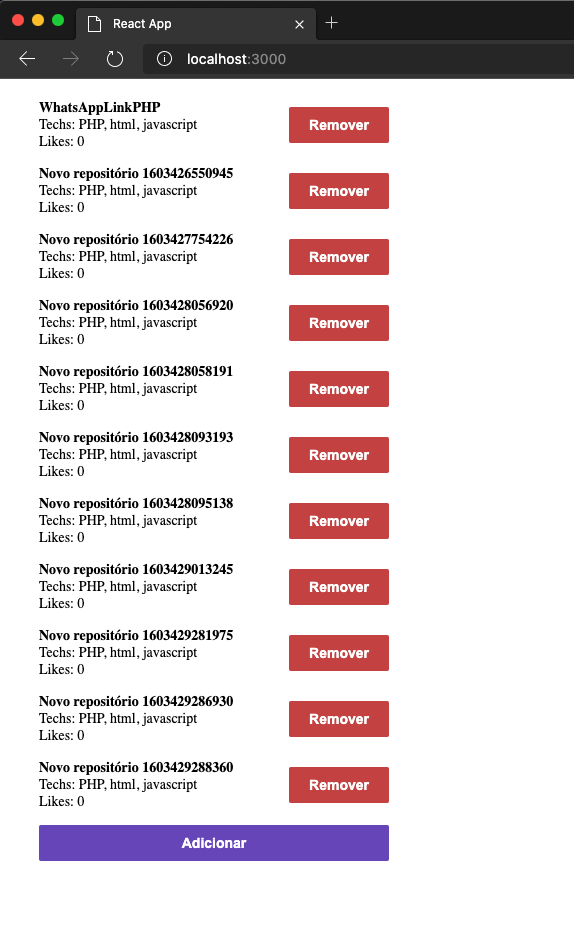

<h3 align="center">
  Challenge 03: ReactJS Concepts
</h3>

  

### 🚀 About the challenge

In this challenge, an application was created to practice what I learned in ReactJS.

The application has the purpose of storing repositories, which will allow you to list, update and delete repositories.

### Application Features

List the repositories for your API: You should be able to create a list with the title field of all the repositories that are registered in your API.

Adding a repository to your API: You should be able to add a new item to your API using a button with the text Add and, after creation, you should be able to display its name after registration.

Remove a repository from your API: For each item on your list, you must have a button with the text Remove which, when clicked, will call a function to remove that item from the list of your frontend and your API.

### Tests Specification

- **`should be able to add new repository`**: For this test to pass, your application must allow a repository to be added to your backend and listed on your frontend within an LI.

- **`should be able to remove repository`**: In order for this test to pass, your application must allow the item to be removed from the list by clicking on the remove button that will be inside the LI of the added repository.

### Layout adjustments

I changed some layout items to better display the content and improve UX.

---

Made with ❤️ by morikawa77